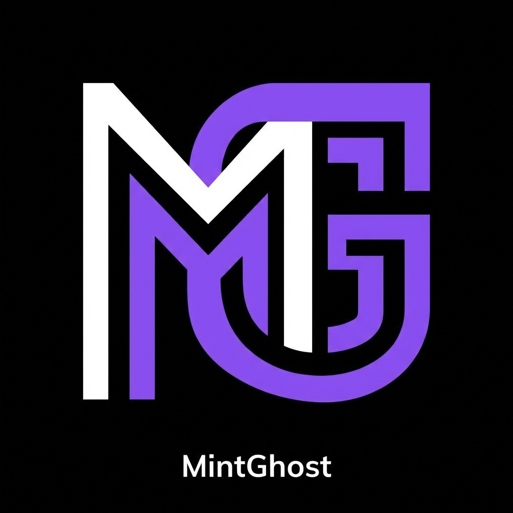

<div align="center">



# MintGhost

**Privacy‑Preserving NFT Minting on Solana using Noir & Zero‑Knowledge Proofs**

App built for **Solana Privacy Hacks** — *Category: App built with Noir*

</div>

---

## Overview

MintGhost is a zero‑knowledge based NFT minting application on Solana.  
It allows users to mint NFTs by **proving eligibility without revealing any private data on‑chain**.

Proofs are generated off‑chain using Noir and Sunspot, and verified on‑chain by a Solana program.

---

## Features

- Zero‑knowledge NFT minting
- Noir circuits for private eligibility logic
- Off‑chain proof generation
- On‑chain verification on Solana
- No allowlists or exposed mint conditions
- Simple frontend for interaction

---

## Quickstart

```bash
git clone https://github.com/ushushruth/GhostMint---ZK-NFT-Minting.git
cd GhostMint---ZK-NFT-Minting
anchor build
anchor deploy
sh generate_all_proofs.sh
cd frontend
npm install
npm run dev
```

App runs at:

```
http://localhost:3000
```

---

## How It Works

1. User connects a Solana wallet
2. Private input is provided to a Noir circuit
3. A zero‑knowledge proof is generated locally
4. Proof is submitted to the Solana program
5. Program verifies the proof
6. NFT is minted on success

Private inputs never leave the client.

---

## Proof Generation (Sunspot)

Sunspot is used to work with Noir circuits on Solana.

Sunspot is difficult to run reliably in the browser, so proofs are generated **locally using CLI binaries from the cloned Sunspot repository**.

```bash
git clone https://github.com/reilabs/sunspot.git
```

```bash
sunspot compile circuit.json
sunspot setup circuit.ccs
sunspot prove circuit.json witness.gz circuit.ccs proving_key.pk
sunspot verify verifying_key.vk proof.proof public_witness.pw
```

---

## Environment Variables

Create `frontend/.env.local`:

```bash
NEXT_PUBLIC_SOLANA_CLUSTER_URL=https://api.devnet.solana.com
NEXT_PUBLIC_PROGRAM_ID=<program_id>
```

---

## Tech Stack

- Solana
- Rust & Anchor
- Noir (Nargo)
- Sunspot
- React / Next.js
- Phantom Wallet

---

## Project Structure

```
GhostMint---ZK-NFT-Minting/
├── frontend/
├── programs/
│   └── mintghost/
├── sdk/
├── Prover.toml
├── generate_all_proofs.sh
├── Anchor.toml
├── Cargo.toml
└── README.md
```

---

## Limitations & Future Work

- In‑browser proof generation
- Proof verification cost optimization
- Multiple Noir circuit support
- Improved frontend UX
- Mainnet readiness and audits

---

## License

This project is open source and licensed under the **Apache License 2.0**.
